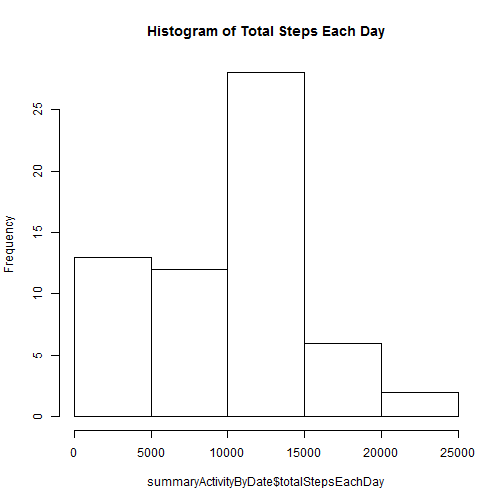
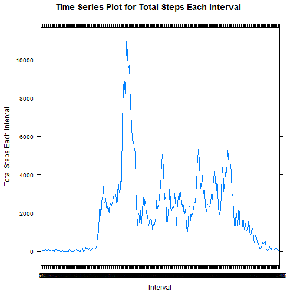
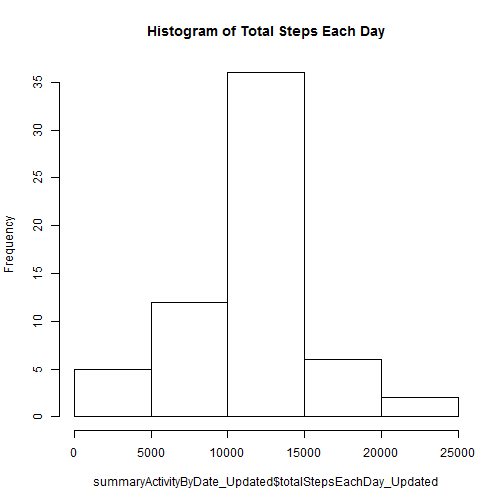
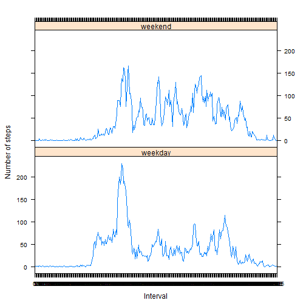

# **Reproducible Research: Week 2 Peer Graded Assignment** 
==========================================

## *Loading and preprocessing the data*

Step 1. Load the data using read.csv(), convert the loaded data into a data table

```r
library(data.table)
ActivityDF<-read.csv("activity.csv")
ActivityDT<-data.table(ActivityDF)
str(ActivityDT)
```

```
## Classes 'data.table' and 'data.frame':	17568 obs. of  3 variables:
##  $ steps   : int  NA NA NA NA NA NA NA NA NA NA ...
##  $ date    : Factor w/ 61 levels "2012-10-01","2012-10-02",..: 1 1 1 1 1 1 1 1 1 1 ...
##  $ interval: int  0 5 10 15 20 25 30 35 40 45 ...
##  - attr(*, ".internal.selfref")=<externalptr>
```

Step 2. Process Transform the Data.
- Convert "interval" from integer to factor
- Add one column datetime of type Date by Convert "date" from factor to date


```r
ActivityDT$interval<-as.factor(ActivityDT$interval)
ActivityDT$datetime<-transform(as.Date(ActivityDT$date))
str(ActivityDT)
```

```
## Classes 'data.table' and 'data.frame':	17568 obs. of  4 variables:
##  $ steps   : int  NA NA NA NA NA NA NA NA NA NA ...
##  $ date    : Factor w/ 61 levels "2012-10-01","2012-10-02",..: 1 1 1 1 1 1 1 1 1 1 ...
##  $ interval: Factor w/ 288 levels "0","5","10","15",..: 1 2 3 4 5 6 7 8 9 10 ...
##  $ datetime: Date, format: "2012-10-01" "2012-10-01" ...
##  - attr(*, ".internal.selfref")=<externalptr>
```

## *What is mean total number of steps taken per day?*

Step 1. Calculate the total number of steps taken per day
- Sum of all steps divided by
- Count of unique dates


```r
library(dtplyr)
library(dplyr)
meanTotalStepsPerDay<-sum(ActivityDT$steps, na.rm=TRUE)/nlevels(unique(ActivityDT$date))
paste("Mean Total Steps Per Day" = meanTotalStepsPerDay)
```

```
## [1] "9354.22950819672"
```

Step 2. Make a histogram of the total number of steps taken each day
- Group the data by date
- Call hist function to make histogram 


```r
groupedDate<-group_by(ActivityDT, date)
summaryActivityByDate<-summarize(groupedDate, totalStepsEachDay=sum(steps,na.rm=TRUE),meanStepsEachDay=mean(steps,na.rm=TRUE), medianStepsEachDay=median(steps,na.rm=TRUE))
hist(summaryActivityByDate$totalStepsEachDay, main=("Histogram of Total Steps Each Day"))
```



Step 3a. Calculate and report the mean and median of the "total number of steps taken each day"


```r
meanOfTotalStepsEachDay<-mean(summaryActivityByDate$totalStepsEachDay,na.rm=TRUE)
medianOfTotalStepsEachDay<-median(summaryActivityByDate$totalStepsEachDay,na.rm=TRUE)
c(paste(("Mean of Total Steps Each Day = "), meanOfTotalStepsEachDay),paste(("Median of Total Steps Each Day = "),medianOfTotalStepsEachDay))
```

```
## [1] "Mean of Total Steps Each Day =  9354.22950819672"
## [2] "Median of Total Steps Each Day =  10395"
```
Step 3b. Calculate and report the mean and median of the "number of steps taken each day"


```r
"Mean and Median of Steps taken each day"; summaryActivityByDate[,c(1,3,4)]
```

```
## [1] "Mean and Median of Steps taken each day"
```

```
## Source: local data table [61 x 3]
## 
## # tbl_dt [61 × 3]
##          date meanStepsEachDay medianStepsEachDay
##        <fctr>            <dbl>              <dbl>
## 1  2012-10-01              NaN                 NA
## 2  2012-10-02          0.43750                  0
## 3  2012-10-03         39.41667                  0
## 4  2012-10-04         42.06944                  0
## 5  2012-10-05         46.15972                  0
## 6  2012-10-06         53.54167                  0
## 7  2012-10-07         38.24653                  0
## 8  2012-10-08              NaN                 NA
## 9  2012-10-09         44.48264                  0
## 10 2012-10-10         34.37500                  0
## # ... with 51 more rows
```

## *What is the average daily activity pattern?*

1. Make a time series plot of the 5-minute interval (x-axis) and the average number of steps taken, averaged across all days (y-axis)
- Group the data by Interval
- Summarize on toatal Step
- Plot the time series (Line plot, type="l") 


```r
library(ggplot2)
library(lattice)
groupedInterval<-group_by(ActivityDT, interval)
summaryActivityByInterval<-summarize(groupedInterval, totalStepsEachInterval=sum(steps,na.rm=TRUE), meanStepsEachInterval=mean(steps,na.rm=TRUE))
xyplot(summaryActivityByInterval$totalStepsEachInterval~summaryActivityByInterval$interval,type="l",main="Time Series Plot for Total Steps Each Interval",ylab="Total Steps Each Interval",xlab="Interval")
```



2. Which 5-minute interval, on average across all the days in the dataset, contains the maximum number of steps?
- Use Summary by Interval to get max steps
- Find corresponding interval


```r
paste("Maximum Number of Steps amongst all Intervals: ", "Steps= ", max(summaryActivityByInterval$totalStepsEachInterval))
```

```
## [1] "Maximum Number of Steps amongst all Intervals:  Steps=  10927"
```

```r
"Interval= "; summaryActivityByInterval[(summaryActivityByInterval$totalStepsEachInterval==max(summaryActivityByInterval$totalStepsEachInterval)),"interval"]
```

```
## [1] "Interval= "
```

```
## Source: local data table [1 x 1]
## 
## # tbl_dt [1 × 1]
##   interval
##     <fctr>
## 1      835
```

## *Imputing missing values*
Note that there are a number of days/intervals where there are missing values (coded as NA). 
The presence of missing days may introduce bias into some calculations or summaries of the data.

1. Calculate and report the total number of missing values in the dataset (i.e. the total number of rows with NAs)
- Store good rows(without NA) in an object "goodActivity"
- Count no of rows which are not "goodActivity"


```r
goodActivity<-complete.cases(ActivityDT)
nrow(ActivityDT[!goodActivity,])
```

```
## [1] 2304
```

2. Devise a strategy for filling in all of the missing values in the dataset. 
The strategy does not need to be sophisticated. For example, you could use the mean/median for that day, or the mean for that 5-minute interval, etc.
- Check in each column how many rows have null value
- For steps, update the average for that interval across all dates
- For date check valid previous and succeeding dates and if same, update the date. If borderline case (first or last interval of a date), update as per inteval position
- For interval,update as per position
- On checking it is found that only column "steps" has missing value 


```r
ActivityDT_na<-ActivityDT[!goodActivity, ]
c(nrow(ActivityDT_na[is.na(ActivityDT_na$steps),]),nrow(ActivityDT_na[is.na(ActivityDT_na$interval),]),nrow(ActivityDT_na[is.na(ActivityDT_na$date),]))
```

```
## [1] 2304    0    0
```

3. Create a new dataset that is equal to the original dataset but with the missing data filled in.
- Form Updated dataset from the original data set by binding the summarised average of steps by interval to original data set
- Update the NA value with average values
- Check if any NA value remaining in updated data set


```r
ActivityDT_Updated<-cbind(ActivityDT,summaryActivityByInterval$meanStepsEachInterval,deparse.level = 1)
goodActivity<-complete.cases(ActivityDT_Updated)
ActivityDT_Updated[!goodActivity,]$steps<-round(ActivityDT_Updated[!goodActivity,]$V2)
```

```
## Warning in `[<-.data.table`(`*tmp*`, !goodActivity, , value =
## structure(list(: Coerced 'double' RHS to 'integer' to match the column's
## type; may have truncated precision. Either change the target column to
## 'double' first (by creating a new 'double' vector length 17568 (nrows of
## entire table) and assign that; i.e. 'replace' column), or coerce RHS to
## 'integer' (e.g. 1L, NA_[real|integer]_, as.*, etc) to make your intent
## clear and for speed. Or, set the column type correctly up front when you
## create the table and stick to it, please.
```

```r
head(ActivityDT_Updated)
```

```
##    steps       date interval   datetime        V2
## 1:     2 2012-10-01        0 2012-10-01 1.7169811
## 2:     0 2012-10-01        5 2012-10-01 0.3396226
## 3:     0 2012-10-01       10 2012-10-01 0.1320755
## 4:     0 2012-10-01       15 2012-10-01 0.1509434
## 5:     0 2012-10-01       20 2012-10-01 0.0754717
## 6:     2 2012-10-01       25 2012-10-01 2.0943396
```
- Check if any NA value remaining in updated data set


```r
goodActivity1<-complete.cases(ActivityDT_Updated)
nrow(ActivityDT_Updated[!goodActivity1,])
```

```
## [1] 0
```

4. Make a histogram of the total number of steps taken each day and Calculate and report the mean and median of total number of steps taken per day. 
Do these values differ from the estimates from the first part of the assignment? 
What is the impact of imputing missing data on the estimates of the total daily number of steps?
- Calculate New value of Total Steps taken each day
- Draw Histogram  


```r
groupedDate_Updated<-group_by(ActivityDT_Updated, date)
summaryActivityByDate_Updated<-summarize(groupedDate_Updated, totalStepsEachDay_Updated=sum(steps,na.rm=TRUE))
hist(summaryActivityByDate_Updated$totalStepsEachDay_Updated, main=("Histogram of Total Steps Each Day"))
```


- Calculate Updated mean and median of total number of steps taken per day


```r
meanOfTotalStepsEachDay_Updated<-mean(summaryActivityByDate_Updated$totalStepsEachDay_Updated,na.rm=TRUE)
medianOfTotalStepsEachDay_Updated<-median(summaryActivityByDate_Updated$totalStepsEachDay_Updated,na.rm=TRUE)
c(paste(("Updated Mean of Total Steps Each Day = "), meanOfTotalStepsEachDay_Updated),paste(("Updated Median of Total Steps Each Day = "),medianOfTotalStepsEachDay_Updated))
```

```
## [1] "Updated Mean of Total Steps Each Day =  10765.6393442623"
## [2] "Updated Median of Total Steps Each Day =  10762"
```
- Find Difference in value of Total Steps taken each day for Mean


```r
c(paste(("Updated Mean of Total Steps Each Day = "), meanOfTotalStepsEachDay_Updated),paste(("Old Mean of Total Steps Each Day = "), meanOfTotalStepsEachDay), paste(("Difference in new and updated (New-Old) = "), meanOfTotalStepsEachDay_Updated - meanOfTotalStepsEachDay))
```

```
## [1] "Updated Mean of Total Steps Each Day =  10765.6393442623"   
## [2] "Old Mean of Total Steps Each Day =  9354.22950819672"       
## [3] "Difference in new and updated (New-Old) =  1411.40983606558"
```
- Find Difference in value of Total Steps taken each day for Median


```r
c(paste(("Updated Median of Total Steps Each Day = "), medianOfTotalStepsEachDay_Updated),paste(("Old Median of Total Steps Each Day = "), medianOfTotalStepsEachDay), paste(("Difference (New-Old) = "), medianOfTotalStepsEachDay_Updated - medianOfTotalStepsEachDay))
```

```
## [1] "Updated Median of Total Steps Each Day =  10762"
## [2] "Old Median of Total Steps Each Day =  10395"    
## [3] "Difference (New-Old) =  367"
```

- Find the difference in total daily number of steps where Old and New are different


```r
summaryActivityByDate_Updated1<-cbind(summaryActivityByDate_Updated, summaryActivityByDate$totalStepsEachDay)
summaryActivityByDate_Updated1$Diff<-(summaryActivityByDate_Updated1$totalStepsEachDay_Updated-summaryActivityByDate_Updated1$V2)
summaryActivityByDate_Updated1[(summaryActivityByDate_Updated1$Diff!=0),]
```

```
##          date totalStepsEachDay_Updated V2  Diff
## 1: 2012-10-01                     10762  0 10762
## 2: 2012-10-08                     10762  0 10762
## 3: 2012-11-01                     10762  0 10762
## 4: 2012-11-04                     10762  0 10762
## 5: 2012-11-09                     10762  0 10762
## 6: 2012-11-10                     10762  0 10762
## 7: 2012-11-14                     10762  0 10762
## 8: 2012-11-30                     10762  0 10762
```

- Mean, Median has increased due to updation of NA by Average no of Steps

## *Are there differences in activity patterns between weekdays and weekends?*

For this part the weekdays() function may be of some help here. Use the dataset with the filled-in missing values for this part.

1.Create a new factor variable in the dataset with two levels – “weekday” and “weekend” indicating whether a given date is a weekday or weekend day.


```r
ActivityDT_Updated$weekday<-wday(ActivityDT_Updated$datetime)
ActivityDT_Updated$labels<-as.factor(ifelse((ActivityDT_Updated$weekday==1 | ActivityDT_Updated$weekday==7),"weekend","weekday"))
ActivityDT_Updated
```

```
##        steps       date interval   datetime        V2 weekday  labels
##     1:     2 2012-10-01        0 2012-10-01 1.7169811       2 weekday
##     2:     0 2012-10-01        5 2012-10-01 0.3396226       2 weekday
##     3:     0 2012-10-01       10 2012-10-01 0.1320755       2 weekday
##     4:     0 2012-10-01       15 2012-10-01 0.1509434       2 weekday
##     5:     0 2012-10-01       20 2012-10-01 0.0754717       2 weekday
##    ---                                                               
## 17564:     5 2012-11-30     2335 2012-11-30 4.6981132       6 weekday
## 17565:     3 2012-11-30     2340 2012-11-30 3.3018868       6 weekday
## 17566:     1 2012-11-30     2345 2012-11-30 0.6415094       6 weekday
## 17567:     0 2012-11-30     2350 2012-11-30 0.2264151       6 weekday
## 17568:     1 2012-11-30     2355 2012-11-30 1.0754717       6 weekday
```


2. Make a panel plot containing a time series plot of the 5-minute interval (x-axis) and the average number of steps taken, 
averaged across all weekday days or weekend days (y-axis). 
See the README file in the GitHub repository to see an example of what this plot should look like using simulated data.


```r
groupedIntervalWeekday<-group_by(ActivityDT_Updated, labels, interval)
summaryActivityByIntervalWeekday<-summarize(groupedIntervalWeekday, meanStepsEachInterval=mean(steps,na.rm=TRUE))
xyplot(summaryActivityByIntervalWeekday$meanStepsEachInterval~summaryActivityByIntervalWeekday$interval|summaryActivityByIntervalWeekday$labels,layout=(c(1,2)),type="l",ylab="Number of steps",xlab="Interval")
```



## *End of Document*


